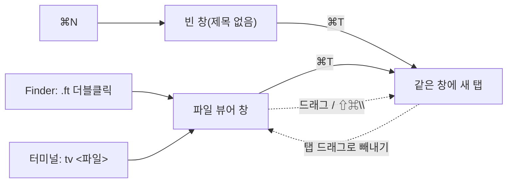

# Multi-Window Text Viewer

`.ft` 텍스트 파일을 **창마다 하나씩** 띄워 보는 macOS용 멀티 윈도우 뷰어입니다.
Tauri 2 + React + TypeScript로 만들었고, macOS 네이티브 탭으로 창을 합치거나 나눌 수 있습니다.

> 현재는 **읽기 전용 뷰어**입니다. 편집·저장은 아직 구현되지 않았습니다(새 파일/빈 창은 자리만 표시).

## 기능

- **`.ft` 파일 연결** — Finder에서 `.ft` 파일을 더블클릭하면 이 앱으로 열립니다.
- **파일별 윈도우 + 중복 방지** — 파일마다 새 창으로 열되, 같은 파일이 이미 열려 있으면 새 창을 만들지 않고 그 창을 활성화합니다(경로 정규화 기반).
- **존재하지 않는 파일** — 빈 창으로 열립니다(저장 기능은 추후).
- **안내 창** — 파일 없이 실행하면 안내 + "파일 열기" 버튼이 있는 창이 뜹니다.
- **`tv` 명령줄 도구** — 터미널에서 `tv <파일>`로 엽니다. 설정 화면에서 설치/제거할 수 있습니다.
- **네이티브 탭** — 같은 탭 그룹의 창들을 드래그하거나 메뉴로 합치고 나눌 수 있습니다.

### 단축키 / 메뉴

| 단축키 | 메뉴 | 동작 |
|--------|------|------|
| `⌘N` | 파일 ▸ 새 파일 | "제목 없음" 빈 창을 새로 엽니다 |
| `⌘T` | 파일 ▸ 새 탭 | 현재 창의 탭 그룹에 빈 탭을 추가합니다(탭 2개부터 탭바 자동 표시) |
| `⇧⌘\` | 보기 ▸ 탭 바 표시/숨기기 | 현재 창의 탭바를 토글합니다 |
| `⌘,` | 보기 ▸ 설정… | 설정 창을 엽니다 |

단축키는 네이티브 메뉴 accelerator로 동작하므로, 창이 활성 상태이기만 하면 됩니다.



## 요구 사항

- macOS (이 앱은 macOS 전용입니다)
- [Rust](https://www.rust-lang.org/) (stable)
- [Node.js](https://nodejs.org/) + [pnpm](https://pnpm.io/)

## 개발

```bash
pnpm install
pnpm tauri dev     # 개발 모드(HMR)
```

> 파일 연결(`.ft` 더블클릭)은 번들된 `.app`에서만 동작합니다. `tauri dev`로는 테스트할 수 없습니다.

## 빌드 / 설치

```bash
pnpm tauri build --bundles app   # .app 번들 생성
```

생성 위치: `src-tauri/target/release/bundle/macos/Multi-Window Text Viewer.app`

`/Applications`로 복사해 설치합니다:

```bash
ditto "src-tauri/target/release/bundle/macos/Multi-Window Text Viewer.app" \
      "/Applications/Multi-Window Text Viewer.app"
```

### `tv` 명령줄 도구

앱의 **설정(⌘,) ▸ 명령줄 도구(tv)**에서 설치/제거할 수 있습니다.
`~/.local/bin/tv`에 현재 앱을 가리키는 스크립트를 생성하며, `~/.local/bin`이 `PATH`에 있어야 합니다.

```bash
tv path/to/file.ft   # 파일 열기(이미 열려 있으면 그 창 활성화)
tv newfile.ft        # 없는 파일이면 빈 창
tv                   # 앱 활성화(미실행 시 안내 창)
# 디렉터리는 열 수 없습니다.
```

## 아키텍처

- **프론트엔드**: `src/` — React + TypeScript (Vite). 쿼리스트링(`?path=…&new=1`, `?view=settings`)으로 창의 표시 내용을 결정합니다.
- **백엔드**: `src-tauri/src/lib.rs` — 윈도우 열기/중복 방지, CLI 인자 처리, 네이티브 메뉴, `tv` 설치 등. macOS 네이티브 동작(탭·활성화)은 `objc2-app-kit`으로 `NSWindow`/`NSApplication`을 직접 호출합니다.
- **단일 인스턴스**: `tauri-plugin-single-instance`로 `tv` 두 번째 실행의 인자를 첫 인스턴스에 전달합니다.
