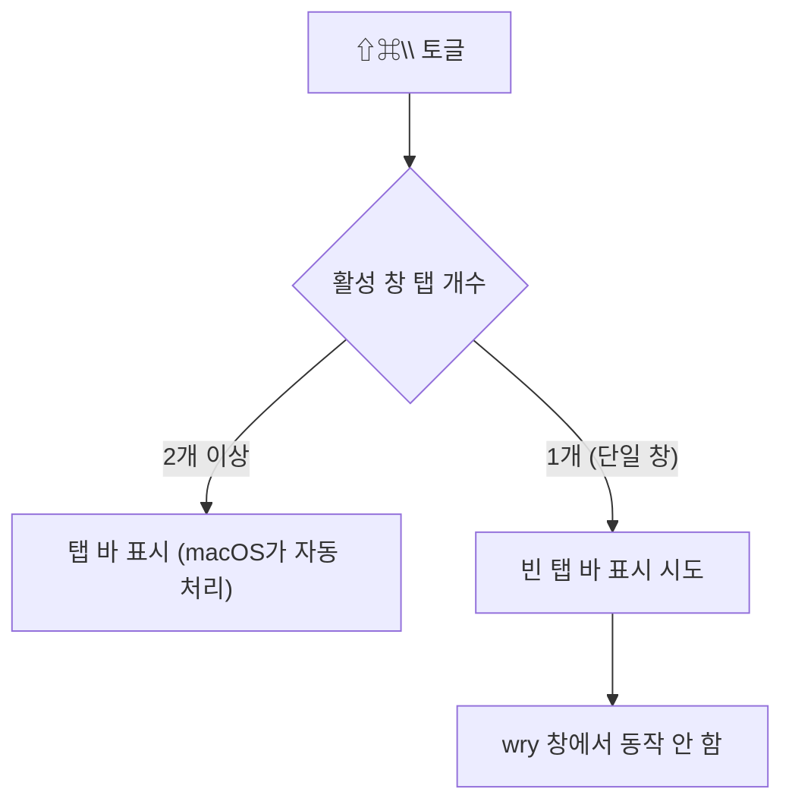

# 탭 바 표시/숨기기 기능 조사 기록

- 날짜: 2026-06-19
- 대상: `⇧⌘\` "탭 바 표시/숨기기" 메뉴 (macOS)
- 결론: **단일 창에서의 탭 바 토글은 macOS 네이티브 탭 + Tauri/wry 조합에서 동작하지 않음.** 해당 메뉴를 제거하고 네이티브 탭 동작만 유지하기로 결정.

## 증상

탭이 없는 단일 창에서 `⇧⌘\`(또는 "보기 → 탭 바 표시/숨기기" 메뉴)를 눌러도 아무 변화가 없음.

## 진단 환경

| 항목 | 값 |
|---|---|
| OS | macOS (Darwin 24.6, Sequoia 15.6) |
| 프레임워크 | Tauri 2, wry/tao |
| AppKit 바인딩 | `objc2` 0.6, `objc2-app-kit` 0.3 |
| 실행 | `pnpm tauri dev` (watch 자동 재빌드) |
| 메뉴 자동 조작 | AppleScript `System Events` (메뉴 항목 클릭) |
| 화면 확인 | macOS `screencapture -R<영역>` |

조사 대상 함수(당시):

```rust
#[cfg(target_os = "macos")]
fn toggle_key_window_tab_bar(app: &AppHandle) {
    use objc2::MainThreadMarker;
    use objc2_app_kit::NSApplication;
    let _ = app.run_on_main_thread(|| {
        if let Some(mtm) = MainThreadMarker::new() {
            let ns_app = NSApplication::sharedApplication(mtm);
            if let Some(win) = ns_app.keyWindow() {
                win.toggleTabBar(None);
            }
        }
    });
}
```

검증을 위해 토글 직전/직후의 NSWindow 상태를 `eprintln!`으로 측정했다. 측정 항목: `keyWindow`/`mainWindow` 존재 여부, `tabbingMode`, `styleMask`, `NSWindowTabGroup.isTabBarVisible`(토글 전후 비교).

## 조사 타임라인 (단계별 실측)

### 1단계 — `keyWindow`가 `None`이라 호출 자체가 무시됨

비활성(백그라운드) 상태에서 메뉴를 클릭하니:

```
[tabbar] keyWindow=false mainWindow=false
```

`if let Some(win) = ns_app.keyWindow()` 분기가 false → `toggleTabBar:`가 **호출조차 되지 않음**. "toggleTabBar called" 로그도 찍히지 않았다.

앱을 확실히 활성화(frontmost)한 직후에는:

```
[tabbar] keyWindow=true mainWindow=true
[tabbar] total NSWindows=2
  title="Multi-Window Text Viewer" isKey=true isMain=true isVisible=true tabbingMode=NSWindowTabbingMode(0)
  title="" isKey=false isMain=false isVisible=false tabbingMode=NSWindowTabbingMode(0)
[tabbar] toggleTabBar called
```

→ **대응:** 대상 창 선택을 `keyWindow → mainWindow → 첫 visible 창` 폴백으로 보강해 호출은 항상 일어나도록 수정했다.

### 2단계 — 호출돼도 탭 바가 켜지지 않음 (welcome 창)

폴백 적용 후 `isTabBarVisible`를 토글 전후로 비교하니, 호출은 되지만 상태가 변하지 않았다:

```
[tabbar] title="Multi-Window Text Viewer" tabBarVisible Some(false) -> Some(false)
[tabbar] title="Multi-Window Text Viewer" tabBarVisible Some(false) -> Some(false)
[tabbar] title="Multi-Window Text Viewer" tabBarVisible Some(false) -> Some(false)
```

2·3번째 클릭의 `before`도 계속 `false` → 애니메이션 지연이 아니라 정말로 켜지지 않은 것.

### 3단계 — 파일 창(`tabbing_identifier` 있음)도 동일

welcome 창은 `tabbing_identifier`가 없으니, 식별자가 있는 파일 창으로 다시 확인:

```
[tabbar] title="sample.ft" tabbingMode=NSWindowTabbingMode(0) tabBarVisible Some(false) -> Some(false)
```

`tabbingMode=0`(=`Automatic`)이고 `tabbing_identifier="ft-viewer"`를 설정해도 단일 창 토글은 실패.

### 4단계 — `tabbingMode`를 `Preferred`로 변경 → 효과 없음

`Automatic`은 시스템 설정 *"탭으로 문서 열기"*(기본값 "전체화면일 때만")를 따르므로, `Preferred`로 강제했다:

```
[tabbar] title="sample.ft" modeAfterSet=NSWindowTabbingMode(1) style=NSWindowStyleMask(32783) tgWindows=Some(1) tabBarVisible Some(false) -> Some(false)
```

`modeAfterSet=1`(Preferred)로 반영됐음에도 여전히 `false → false`.

### 5단계 — `styleMask` 분석 후 `FullSizeContentView` 제거 → 효과 없음

`styleMask = 32783 = 0x800F` 비트 분해:

| 비트 | 값 | 플래그 |
|---|---|---|
| `0x1` | Titled | ✓ |
| `0x2` | Closable | ✓ |
| `0x4` | Miniaturizable | ✓ |
| `0x8` | Resizable | ✓ |
| `0x8000` | **FullSizeContentView** | ✓ |

wry가 webview를 타이틀바 영역까지 채우려고 켜는 `FullSizeContentView`가 탭 바를 막는다는 가설로 임시 제거 후 토글:

```
[tabbar] title="sample.ft" hadFullSize=true  tabBarVisible Some(false) -> Some(false)
[tabbar] title="sample.ft" hadFullSize=false tabBarVisible Some(false) -> Some(false)
```

→ `FullSizeContentView`를 꺼도 변화 없음. 이 가설도 기각.

### 6단계 — 실제 화면 확인 (단일 창)

`screencapture`로 단일 창 상단을 캡처: 타이틀바("제목 없음") 바로 아래에 앱 자체 헤더(`제목 없음 · 새 파일 · 아직 저장되지 않음`)만 있고 **macOS 탭 바는 없음**. `isTabBarVisible=false`와 화면이 일치.

### 7단계 — 탭 2개로 묶으면 정상 (결정적 분기)

파일 창에 "새 탭"을 추가해 탭을 2개로 만들자, 캡처에서 탭 바가 정상 표시됐다:

```
┌──────────────────────────────────────────┐
│  ◉ ◉ ◉            제목 없음                │  ← 타이틀바
├────────────────────┬─────────────────────┤
│      sample.ft     │      제목 없음        │  ← 탭 바 (표시됨!)
└────────────────────┴─────────────────────┘
```

즉 **탭이 2개 이상이면 macOS가 탭 바를 자동 표시**하며 wry 창에서도 정상 동작한다. 안 되는 것은 *단일 창의 빈 탭 바 토글*뿐이다.

## 발견 요약

| 상황 | 결과 |
|---|---|
| 탭 **2개 이상** | 탭 바 정상 표시 |
| **단일 창**(탭 1개)에서 토글 | `isTabBarVisible: false → false`, 화면에도 탭 바 없음 |
| 토글 호출 시점에 `keyWindow`/`mainWindow`가 `None` | `toggleTabBar:` 호출 자체가 무시됨 |

## 근본 원인 (2가지)

### 1. `keyWindow` / `mainWindow`가 `None`인 경우 (해결됨)

메뉴/단축키가 처리되는 시점에 `NSApplication.keyWindow()`가 `None`을 반환해 `toggleTabBar:`가 호출조차 되지 않는 케이스. `keyWindow → mainWindow → 첫 visible 창` 폴백으로 보강하면 호출은 항상 일어난다.

### 2. 단일 wry 창에서 빈 탭 바가 표시되지 않음 (본질적 한계)

표준 `NSWindow`는 단일 창에서도 `toggleTabBar:`로 "빈 탭 바"를 띄울 수 있지만, Tauri/wry가 만든 창에서는 동작하지 않는다. 시도한 우회와 결과:

| 시도 | 결과 |
|---|---|
| `tabbingMode` `Automatic` → `Preferred` | 효과 없음 |
| `styleMask`에서 `FullSizeContentView` 제거 | 효과 없음 |
| `tabbing_identifier`("ft-viewer") 설정 창에서 시도 | 효과 없음 |

## 동작 요약



macOS 네이티브 탭은 **탭이 2개 이상일 때만** 탭 바가 의미를 가진다(이때는 정상 동작). 단일 창의 빈 탭 바 토글은 이 앱 구성에서 지원되지 않는다.

## 결정 및 적용한 변경

- "탭 바 표시/숨기기" 메뉴(`⇧⌘\`)와 관련 코드(`toggle_key_window_tab_bar`, 메뉴 이벤트 핸들러, `toggle_tabbar` id)를 제거했다.
- 네이티브 탭 동작은 그대로 유지 — `⌘T`(새 탭)로 탭을 추가하면 macOS가 탭 바를 자동으로 표시한다.

핵심 변경 요지(diff 발췌):

```diff
-    let toggle_item = MenuItemBuilder::new("탭 바 표시/숨기기")
-        .id("toggle_tabbar")
-        .accelerator("Shift+Cmd+\\")
-        .build(app)?;
-
     let view = SubmenuBuilder::new(app, "보기")
         .item(&settings_item)
-        .item(&toggle_item)
         .build()?;
```

```diff
     handle.on_menu_event(|app, event| match event.id().as_ref() {
         "new_file" => open_blank_window(app),
         "new_tab" => { ... }
         "settings" => open_settings_window(app),
-        "toggle_tabbar" => {
-            #[cfg(target_os = "macos")]
-            toggle_key_window_tab_bar(app);
-        }
         _ => {}
     });
```

`toggle_key_window_tab_bar()` 함수 전체 제거. (커밋 `f48d9f9`)

## 향후 옵션 (필요 시)

단일 창에서도 탭 바 토글이 꼭 필요하다면, macOS 네이티브 탭 대신 HTML/CSS 기반의 **커스텀 탭 바 UI**를 직접 구현해야 한다(탭 상태 관리·렌더링 포함).
