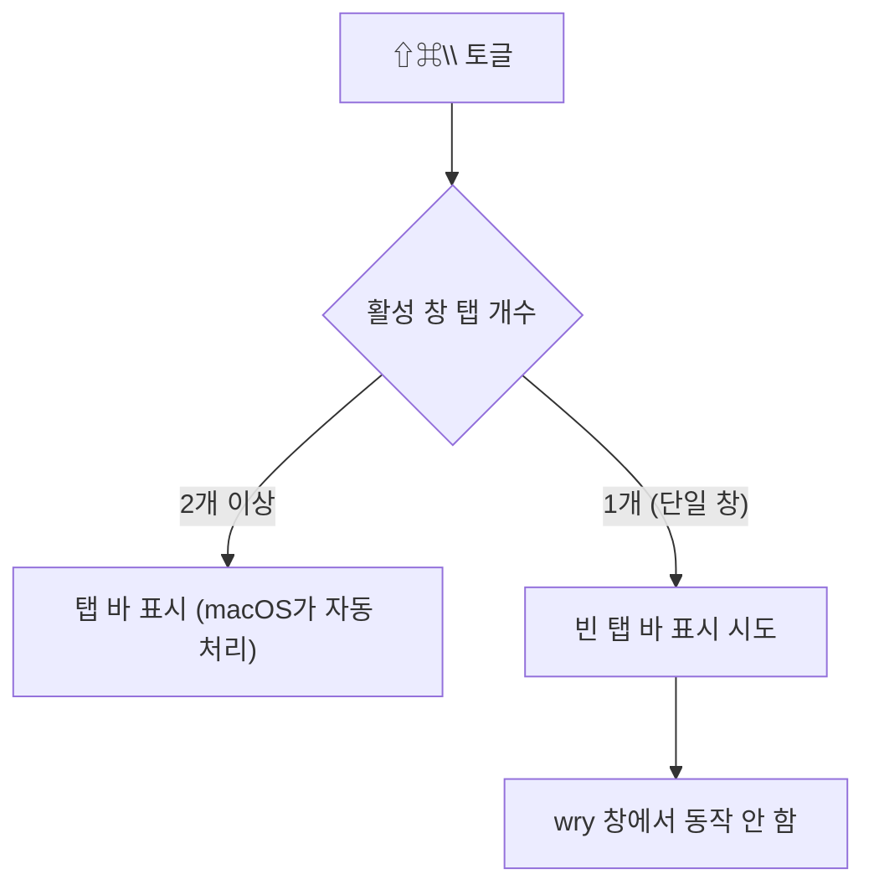

# 탭 바 표시/숨기기 기능 조사 기록

- 날짜: 2026-06-19
- 대상: `⇧⌘\` "탭 바 표시/숨기기" 메뉴 (macOS)
- 결론: **단일 창에서의 탭 바 토글은 macOS 네이티브 탭 + Tauri/wry 조합에서 동작하지 않음.** 해당 메뉴를 제거하고 네이티브 탭 동작만 유지하기로 결정.

## 증상

탭이 없는 단일 창에서 `⇧⌘\`(또는 "보기 → 탭 바 표시/숨기기" 메뉴)를 눌러도 아무 변화가 없음.

## 조사 방법

`pnpm tauri dev`로 앱을 실행한 뒤, 토글 함수에 진단 로그를 넣어 실제 NSWindow 상태를 측정했다.

- `NSApplication.keyWindow` / `mainWindow` 존재 여부
- 대상 창의 `tabbingMode`, `styleMask`
- `NSWindowTabGroup.isTabBarVisible` 를 `toggleTabBar:` 호출 **전후**로 비교
- macOS `screencapture` 로 실제 화면 캡처

메뉴 클릭은 AppleScript(`System Events`)로 자동화했다.

## 발견

| 상황 | 결과 |
|---|---|
| 탭 **2개 이상** | 탭 바 정상 표시 (캡처에서 `sample.ft │ 제목 없음` 탭 확인) |
| **단일 창**(탭 1개)에서 토글 | `isTabBarVisible: false → false`, 화면에도 탭 바 없음 |
| 토글 호출 시점에 `keyWindow`/`mainWindow` 가 `None` | `toggleTabBar:` 호출 자체가 무시됨 |

## 근본 원인 (2가지)

### 1. `keyWindow` / `mainWindow` 가 `None` 인 경우 (해결됨)

메뉴/단축키가 처리되는 시점에 `NSApplication.keyWindow()` 가 `None` 을 반환해 `toggleTabBar:` 가 호출조차 되지 않는 케이스가 있었다.

→ 대상 창 선택을 `keyWindow → mainWindow → 첫 visible 창` 폴백으로 보강해 호출은 항상 일어나도록 수정했다.

### 2. 단일 wry 창에서 빈 탭 바가 표시되지 않음 (본질적 한계)

표준 `NSWindow` 는 단일 창에서도 `toggleTabBar:` 로 "빈 탭 바"를 띄울 수 있지만, Tauri/wry 가 만든 창에서는 동작하지 않았다. 다음 우회를 모두 시도했으나 `isTabBarVisible` 이 `false → false` 로 변하지 않았다.

- `tabbingMode` 를 `Automatic`(기본) → `Preferred` 로 변경 → 효과 없음
- `styleMask` 에서 `FullSizeContentView` 플래그 제거 → 효과 없음

`tabbing_identifier`("ft-viewer")를 설정한 파일 창에서도 동일하게 단일 창 토글은 실패했다.

## 동작 요약

macOS 네이티브 탭은 **탭이 2개 이상일 때만** 탭 바가 의미를 가진다(이때는 정상 동작). 단일 창의 빈 탭 바 토글은 이 앱 구성에서 지원되지 않는다.

## 결정

- "탭 바 표시/숨기기" 메뉴(`⇧⌘\`)와 관련 코드(`toggle_key_window_tab_bar`, 메뉴 이벤트 핸들러)를 제거한다.
- 네이티브 탭 동작은 그대로 유지한다 — `⌘T`(새 탭)로 탭을 추가하면 macOS가 탭 바를 자동으로 표시한다.

## 향후 옵션 (필요 시)

단일 창에서도 탭 바 토글이 꼭 필요하다면, macOS 네이티브 탭 대신 HTML/CSS 기반의 **커스텀 탭 바 UI** 를 직접 구현해야 한다(탭 상태 관리·렌더링 포함).
